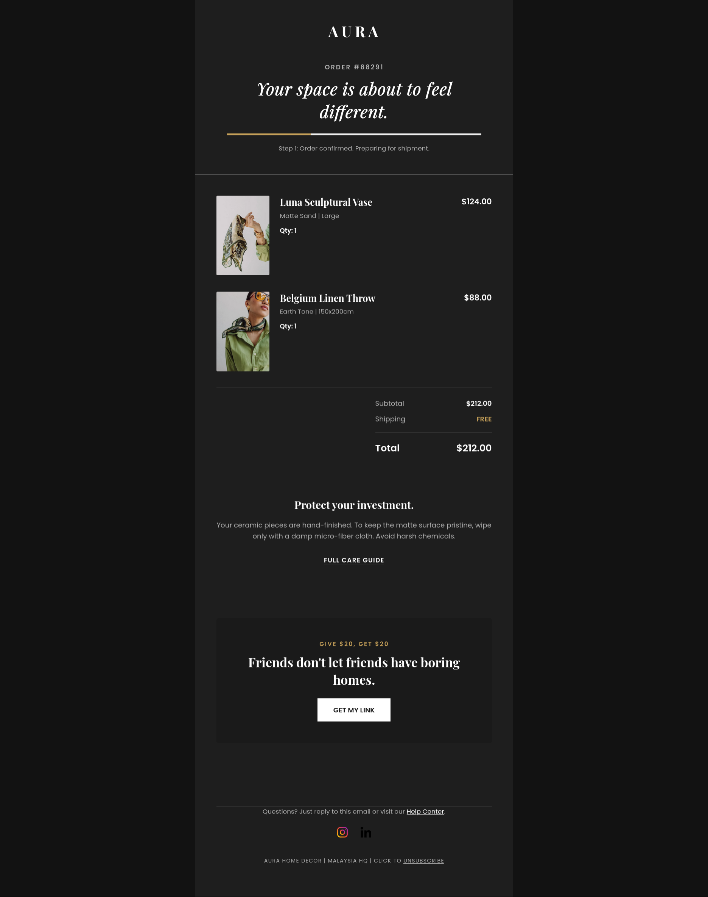
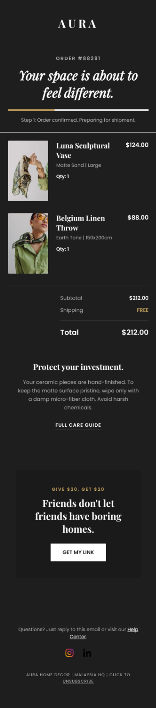

# 🛋️ Aura Home Decor - Dark Mode Order Confirmation
### A Responsive HTML Transactional Email Built for Modern Inboxes

| Desktop Preview | Mobile Preview |
| :--- | :--- |
|  |  |

## 📖 Project Overview
Translating luxury brand aesthetics into the inbox is difficult, especially when dealing with the unpredictable nature of automated dark mode in email clients. When left unoptimized, email clients like Apple Mail and Outlook will force-invert background colors and text, often destroying the design.

This repository showcases a **production-ready Transactional Order Confirmation**, designed for a high-end home decor brand. It is specifically engineered to respect user system preferences with full **Dark Mode support**, ensuring a seamless, premium experience whether the user opens their receipt in a light or dark theme.

## 🛠️ Technical Implementation
To achieve maximum reliability and visual consistency, I implemented the following professional development standards:

* **Advanced Dark Mode Engineering:** Integrated `<meta name="color-scheme" content="light dark">` tags and utilized `@media (prefers-color-scheme: dark)` CSS queries. I built custom utility classes (`.body-bg`, `.card-bg`, `.text-gray`) to manually control color swapping, preventing clients from aggressively auto-inverting the design.
* **Transactional Hierarchy:** Built a clean, table-based data structure to clearly display complex order information (line items, pricing, totals, and shipping) that scales flawlessly down to mobile devices.
* **Client-Specific Resets:** Applied rigorous CSS resets (`mso-table-lspace:0pt;`, `-ms-text-size-adjust:100%;`) to neutralize Microsoft Outlook's default padding and text-scaling behaviors.
* **Web Typography Integration:** Integrated external Google Fonts (`Playfair Display` and `Poppins`) to elevate the brand's luxury aesthetic, backed by strict web-safe system font fallbacks to maintain layout integrity in unsupported clients.

## 🚀 Platform Integration
The modular codebase is highly adaptable and ready for immediate deployment in major CRM, E-commerce, and Marketing Automation platforms, including:
* **Shopify (Notification Templates)**
* **Klaviyo**
* **Salesforce Marketing Cloud**
* **Customer.io**

## 📂 Repository Structure
* `index.html`: The core production-ready HTML code containing dark mode queries.
* `preview.jpg`: Visual representation of the rendered desktop layout (Dark Mode).
* `preview-mobile.jpg`: Visual representation of the rendered mobile layout (Dark Mode).

## 🤝 Contact
**Salah Attar** *Email & Web Developer* | Focused on creating high-conversion, accessible, and technically robust digital experiences.
